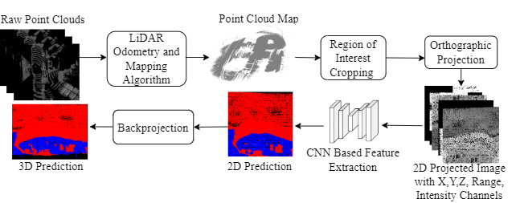
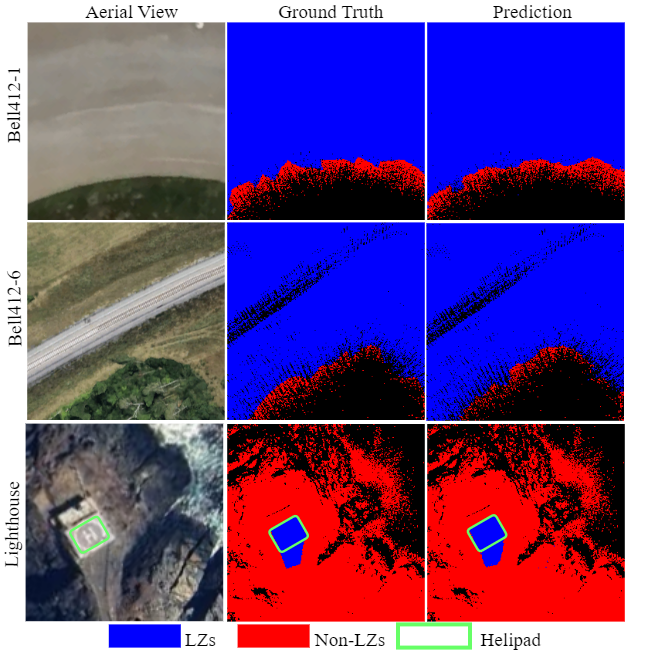
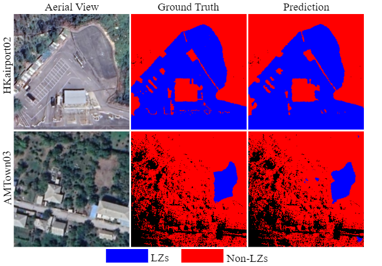
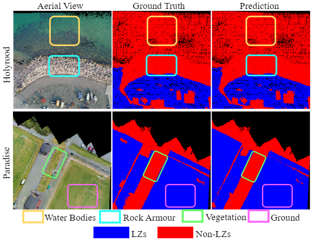

# Projection-Based Artificial Intelligence Safe Landing Zone Detection for Real-Time LiDAR-Navigation Pipelines

## Introduction
This repository contains the supplementary online materials of our work **Projection-Based Artificial Intelligence Safe Landing Zone Detection for Real-Time LiDAR-Navigation Pipelines**. This work introduces an artificial intelligence (AI)-
based real-time safe landing zone detection module (LCDM) for vertical take-off and landing (VTOL) navigation. It employs a projection-based point cloud semantic segmentation (PCSS) convolutional neural network (CNN) model combined with point cloud accumulation and a range image generation module. The CNN employed in this study is a customized version of the <a href="https://github.com/huixiancheng/CENet" target="_blank">CENet </a>. The proposed method addresses the limitations of existing projection-based PCSS methods, which often struggle with low-resolution and non-repetitive scan raw light detection and ranging (LiDAR) data commonly found in aerial datasets. The proposed method was developed using three sets of aerial datasets collected from a DJI M600 hexacopter drone, a DJI M300 RTK quadrotor, and a Bell412 helicopter. The proposed LCDM was evaluated using both qualitative and quantitative metrics, demonstrating its robustness and effectiveness. In terms of quantitative results, the proposed method achieved mean intersection over union (mIoU) and accuracy values greater than 0.93 and 98 percent, respectively, across all three datasets, highlighting its accuracy in identifying safe landing zones (LZs). To assess the real-time feasibility of the proposed LCDM, it was deployed on a reconfigurable hardware-accelerated module. This setup achieved processing rates higher than 10 Hz for all three datasets and a throughput of over 5 million pts/s on the Jetson AGX Xavier dedicated hardware combined with pytorch tensor RT optimization module. The training and inference processes of the proposed method are shown in Figures 1 and 2.

For more information about this work, please see our <a href="https://yettobeadded.com" target="_blank">paper</a>.

<p align="center">
  
</p>
<p align="center"><b>Figure 1:</b> Training Process</p>

<p align="center">
  
</p>
<p align="center"><b>Figure 2:</b> Inference Process</p>


This repository contains the following:

1. Inference code
2. <a href="https://drive.google.com/drive/folders/1gpsx8NPYSj6ThHN1UBvwB8JkxAnc1Irl?usp=sharing" target="_blank">Link </a> to the weight files of the trained models
3. <a href="https://drive.google.com/drive/folders/1PJK-v1QC7MsHdm0dEV_PRicn9LlXuLf2?usp=sharing" target="_blank">Link </a> to sample test data

## Sample results

Here are some sample results from our method for three different datasets,
1. <a href="https://mun-frl-vil-dataset.readthedocs.io/en/latest/" target="_blank">MUN-FRL</a>
2. Holyrood-Paradise
3. <a href="https://mars.hku.hk/dataset.html" target="_blank">HKU-MARS</a>

<p align="center">
  
  
  
</p>


## Instructions to run the code and obtain results

This code is tested in Compute Canada Cloud computers with a A100 GPU, 12GB RAM and Python 3.10
1. Clone this repository using ```https://github.com/nira16herath/CENet-LZ-detection.git``` or download the repository manually to your computer
3. Install the required modules using,
  ```pip install opencv pyyaml torch matplotlib tensorboard tqdm scikit-build scipy torchvision pandas scikit-learn```
   We suggest you create a separate environment with Python 3.10 to install the modules.
6. Download the <a href="https://drive.google.com/drive/folders/1gpsx8NPYSj6ThHN1UBvwB8JkxAnc1Irl?usp=sharing" target="_blank"> trained CNN models </a> and  <a href="https://drive.google.com/drive/folders/1PJK-v1QC7MsHdm0dEV_PRicn9LlXuLf2?usp=sharing" target="_blank">sample test data </a> from the links and include them in the home directory. Sample folder structure of trained CNN models and test data is shown below.

```
├── 𝘁𝗿𝗮𝗶𝗻𝗲𝗱_𝗺𝗼𝗱𝗲𝗹𝘀               
│ ├── test_300by300_bell_lighthouse/                 
│ ├── test_300by300_hkairport02_amtown03/
│ ├── test_300by300_mars/
├── 𝘁𝗲𝘀𝘁_𝗱𝗮𝘁𝗮𝘀𝗲𝘁𝘀               
│ ├── bell-lighthouse/                 
│ ├── holyrood-paradise/
│ ├── mars/            
```

Each test dataset in **test_datasets** folder has the following folder structure. Here **bell-lighthouse** is taken as an example. Here the test data is stored under the sequence **01**. Sequences **00** and **02** are train and valid sequences which contain some dummy ```.bin``` and ```.labels```. These dummy files are included to make sure that no error shown up due to missing training and valid sequences.

```
test_datasets               
├── bell-lighthouse/
│ ├── sequences/                 
│ │ ├── 00/
│ │ │ ├── labels/
│ │ │ │ ├── *.label
│ │ │ ├── velodyne/
│ │ │ │ ├── *.bin
│ │ ├── 01/
│ │ │ ├── labels/
│ │ │ │ ├── *.label      #ground truth labels
│ │ │ ├── velodyne/
│ │ │ │ ├── *.bin        #test LiDAR scans
│ │ ├── 02/
│ │ │ ├── labels/
│ │ │ │ ├── *.label
│ │ │ ├── velodyne/
│ │ │ │ ├── *.bin
```

5. Once the **trained_models** and **test_datasets** folders are properly placed, create a folder named **test_results** in home directory of the repository. Then run this code in the home directory of the repository to get the predictions for test LiDAR scans in sequence **01** of a given dataset.

```
python infer.py -d "path_to_test_dataset" -l "path_to_save_predictions" -m "path_to_trained_model" -s test
```
Example: bell-lighthouse dataset

```
python infer.py -d "test_datasets/bell-lighthouse" -l "test_results/bell-lighthouse" -m "trained_models/test_300by300_bell_lighthouse" -s test
```

The predictions will be saved in **predictions** folder as shown in the following folder structure,
```
test_results             
├── bell-lighthouse/
│ ├── sequences/   
│ │ ├── 00/
│ │ ├── 01/
│ │ │ ├── 𝗽𝗿𝗲𝗱𝗶𝗰𝘁𝗶𝗼𝗻𝘀/
│ │ │ │ ├── *.label
│ │ ├── 02/
```

6. To obtain the orthogonal projected images of ground truths and predictions run,

```
python plot_results.py -p "path_to_predictions" -g "path_to_groundtruths" -m "path_to_trained_model"
```
Example: bell-lighthouse dataset

```
python plot_results.py -p "test_results/bell-lighthouse" -g "test_datasets/bell-lighthouse" -m "trained_models/test_300by300_bell_lighthouse"
```

The images will be saved in **images** folder as shown in the following folder structure,  

```
test_results             
├── bell-lighthouse/
│ ├── sequences/   
│ │ ├── 00/
│ │ ├── 01/
│ │ │ ├── predictions/
│ │ │ │ ├── *.label
│ │ │ ├── 𝗶𝗺𝗮𝗴𝗲𝘀/
│ │ │ │ ├── *_gt.png      
│ │ │ │ ├── *_pred.png
│ │ ├── 02/
```

## Acknowledgement

Special thanks to the developers of, 
1. <a href="https://github.com/huixiancheng/CENet" target="_blank">CENet</a> for their valuable contributions to projection based LiDAR semantic segmentation,
2. <a href="https://github.com/jbehley/point_labeler" target="_blank">Point Cloud Labelling Tool </a>  for their wonderful LiDAR point cloud annotation tool.
3. <a href="https://mun-frl-vil-dataset.readthedocs.io/en/latest/" target="_blank">MUN-FRL</a> and Holyrood-Paradise for their valuable datasets
3. <a href="https://mars.hku.hk/dataset.html" target="_blank">HKU-MARS</a> dataset for their valuable dataset.


